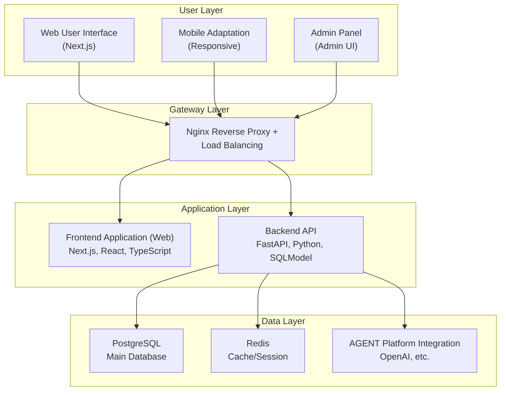

# BAIT: Build AI Template

**Build AI Template** is an open-source AI application template for developers, using the `FastAPI` + `Next.js` tech stack. It integrates mainstream AI platforms and comes with built-in **user management**, **intelligent chat**, **membership payments**, and a **visual admin dashboard** to help you efficiently build modern AI products.

[中文 README](README.md)

> [!IMPORTANT]
> 🚀 **Quick Start**: Click the [Use this template](https://github.com/open-v2ai/build-ai-template/generate) button in the top right corner of the page to create your new project!

[Live Demo 🔗](https://bait.v2ai.org)

<picture>
  <source media="(prefers-color-scheme: dark)" srcset="https://raw.githubusercontent.com/open-v2ai/build-ai-template/refs/heads/test/.github/images/screenshot_v0_1_dark_web_en.png">
  <source media="(prefers-color-scheme: light)" srcset="https://raw.githubusercontent.com/open-v2ai/build-ai-template/refs/heads/test/.github/images/screenshot_v0_1_light_web_en.png">
  
</picture>

<picture>
  <source media="(prefers-color-scheme: dark)" srcset="https://raw.githubusercontent.com/open-v2ai/build-ai-template/refs/heads/test/.github/images/screenshot_v0_1_dark_admin_en.png">
  <source media="(prefers-color-scheme: light)" srcset="https://raw.githubusercontent.com/open-v2ai/build-ai-template/refs/heads/test/.github/images/screenshot_v0_1_light_admin_en.png">
  
</picture>

[Online Docs 🔗](https://bait-docs.v2ai.org)

<picture>
  <source media="(prefers-color-scheme: dark)" srcset="https://raw.githubusercontent.com/open-v2ai/build-ai-template/refs/heads/test/.github/images/screenshot_v0_1_dark_docs_en.png">
  <source media="(prefers-color-scheme: light)" srcset="https://raw.githubusercontent.com/open-v2ai/build-ai-template/refs/heads/test/.github/images/screenshot_v0_1_light_docs_en.png">
  
</picture>

## 🎯 Project Highlights

- **🚀 Out-of-the-Box**: A complete AI application solution, no need to start from scratch.
- **🔧 Highly Customizable**: Modular design for easy extension and customization of features.
- **🌍 Multi-platform Support**: Integrates with mainstream AI platforms like OpenAI, Dify, FastGPT, Coze.
- **📱 Modern Interface**: Beautiful responsive design based on Shadcn UI.
- **🔒 Enterprise-grade Security**: Comprehensive user authentication and permission management.
- **📊 Data Insights**: Detailed usage statistics and an admin dashboard.

## Core Features

### 🤖 Intelligent Agent System

- [x] **Multi-platform Support**: Integrates with mainstream AI platforms like OpenAI and Dify (FastGPT, Coze are under development...).
- [x] **Agent Management**: Visually create, edit, and manage multiple AI assistants.
- [x] **Model Configuration**: Flexible model parameter settings (temperature, token limits, etc.).
- [x] **Connection Testing**: Real-time testing of Agent availability and response speed.
- [x] **Streaming Response**: Real-time streaming chat with a typewriter effect.

### 👥 User Management System

- [x] **Email Verification Code Login**: Secure and convenient passwordless login with email verification.
- [x] **Membership System**: Supports multiple tiers like Free, Monthly, and Yearly plans.
- [x] **Usage Statistics**: Detailed statistics for messages, tokens, and conversation counts.
- [x] **Permission Management**: Separation of user and administrator roles.
- [x] **Auto Admin**: The first user to log in automatically gets administrator privileges.

### 💬 Chat System

- [x] **Real-time Chat**: Streaming responses to show the AI's thinking process.
- [x] **Chat History**: Complete conversation records and management.
- [x] **Multi-turn Conversation**: Supports context-aware continuous dialogue.
- [x] **Markdown Rendering**: Supports code highlighting and formatted display.
- [x] **Usage Limits**: Controls usage based on membership level.

### 🛠 Admin Dashboard

- [x] **Data Analytics**: Visualization of core data like users, chats, and messages.
- [x] **User Management**: View, edit, delete users, and manage permissions.
- [x] **Chat Management**: View all user conversation records and details.
- [x] **Agent Management**: Create, configure, and monitor AI assistants.
- [x] **System Monitoring**: Real-time system status and performance metrics.

### 🌍 Internationalization & UI

- [x] **Multi-language Support**: Complete internationalization for Chinese and English.
- [x] **Responsive Design**: Perfectly adapts to both desktop and mobile devices.
- [x] **Dark Mode**: Supports switching between light and dark themes.
- [x] **Modern UI**: A beautiful interface based on Shadcn UI.
- [x] **Accessibility**: Complies with accessibility standards.

### 🚀 Deployment & Operations

- [x] **Docker Deployment**: A complete containerized deployment solution.
- [x] **Environment Configuration**: Flexible environment variable configuration.
- [x] **Database Migration**: Automated database version management with Alembic.
- [x] **Health Checks**: Service status monitoring and automatic recovery.
- [x] **Reverse Proxy**: Nginx for load balancing and static file serving.

## Tech Stack

### Backend Technologies

- **Framework**: FastAPI + Python 3.12
- **Database**: PostgreSQL + SQLModel + Alembic
- **Cache**: Redis
- **AI Integration**: OpenAI API + Multi-platform Agent support
- **Authentication**: JWT + Email verification code
- **Package Manager**: uv

### Frontend Technologies

- **Framework**: Next.js 15.3 + React 19 + TypeScript
- **UI Components**: Shadcn UI + Tailwind CSS
- **Internationalization**: next-intl
- **State Management**: React Hooks
- **Package Manager**: pnpm

### Deployment Technologies

- **Containerization**: Docker + Docker Compose
- **Reverse Proxy**: Nginx
- **Data Persistence**: PostgreSQL + Redis data volumes

## ⚡ Quick Start

> [!WARNING]
> **Minimum System Requirements**:
>
> - **CPU**: 2 Cores
> - **Memory**: 4 GB
> - **Storage**: 20 GB

### Method 1: Docker One-click Deployment (Recommended)

This is the simplest and fastest way to deploy, suitable for quick trials and production environments.

**Prerequisites:**

- Docker >= 26.0
- Docker Compose >= 2.25

**Deployment Steps:**

1. **Clone the project**

   ```bash
   git clone https://github.com/open-v2ai/build-ai-template.git
   cd build-ai-template/deploy/
   ```

2. **Configure environment variables**

   ```bash
   # Copy the environment variable template
   cp .env.example .env
   # Edit the .env file to configure the necessary environment variables
   vim .env
   ```

   **Required configurations**:

   ```bash
   # AGENT Configuration (required)
   AGENT_API_KEY=sk-proj-***
   AGENT_BASE_URL=https://api.openai.ai/v1/chat/completions
   AGENT_MODEL_NAME=gpt-4.1-mini

   # Mail Configuration (required for login verification codes)
   MAIL_USERNAME=no-reply@example.com
   MAIL_PASSWORD=123456
   MAIL_FROM=no-reply@example.com
   MAIL_PORT=587
   MAIL_SERVER=smtp.example.com
   ```

3. **Start the services**

   ```bash
   docker compose up -d
   ```

4. **Access the application**
   - **User Interface**: `http://localhost:8081`
   - **Admin Dashboard**: `http://localhost:8081/admin`
   - **Documentation**: `http://localhost:8082`

### Method 2: Development Environment

1. **Clone the repository**

   ```bash
   git clone https://github.com/open-v2ai/build-ai-template.git
   cd build-ai-template
   ```

2. **Run database services**

   ```bash
   # Run PostgreSQL
   bash api/scripts/run_postgres.sh

   # Run Redis
   bash api/scripts/run_redis.sh
   ```

3. **Configure and run the backend**

   > Requirements: Python >= 3.12, uv >= 0.6

   ```bash
   cd api/

   # Install dependencies
   uv sync

   # Activate virtual environment
   source venv/bin/activate

   # Configure environment variables
   cp .env.example .env
   # Edit the .env file to configure database connection, AGENT API Key, etc.

   # Run database migrations
   alembic upgrade head

   # Start development server (port 8000)
   python -m app.main
   ```

   **Configure Payment Module (Optional)**

   ```bash
   # Open a new terminal and execute the following commands
   cd api/
   source venv/bin/activate

   # Login to Stripe
   stripe login
   stripe listen --forward-to localhost:8000/api/v1/orders/stripe/webhook
   # Copy the generated webhook secret to the .env file
   STRIPE_WEBHOOK_SECRET=whsec_cexxx
   ```

4. **Configure and run the frontend**

   > Requirements: Node.js >= 18.19, pnpm >= 10.11

   ```bash
   # Open a new terminal
   cd web/

   # Install dependencies
   pnpm install

   # Configure environment variables
   cp .env.example .env
   # Edit the .env file to configure API address, etc.

   # Start development server (port 3000)
   pnpm dev
   ```

5. **Access the application**
   - **User Interface**: `http://localhost:3000`
   - **Admin Dashboard**: `http://localhost:3000/admin`
   - **Documentation**: `http://localhost:4000`

   > [!NOTE]
   >
   > - **Testing Environment Mail Configuration**: You can set `AUTH_IS_DEBUG=True` and `AUTH_DEBUG_CODE=888888` to bypass email verification for direct login or registration, which is convenient for local development and testing.
   > - **Auto Admin Setup**: The first user to register via email verification will automatically become an administrator!

### 🚨 Common Issues

- **Service fails to start**:
  - **Check for port conflicts**: For Docker deployment, ensure ports 8081 and 8082 are not in use. For the development environment, ensure ports 8000, 3000, and 4000 are not occupied.
  - **Check Docker**: Make sure the Docker service is running.
  - **View logs**: Use `docker compose logs -f` to check for error messages.
- **AGENT fails to respond**:
  - **Check API Key**: Ensure the AGENT API Key is valid and has a sufficient balance.
  - **Check network**: Ensure the server can access the AGENT API.
  - **Check model**: Confirm the model name is correct (e.g., `gpt-4o-mini`).
- **Email fails to send**:
  - **Testing Environment**: You can set `AUTH_IS_DEBUG=True` and `AUTH_DEBUG_CODE=888888` to bypass email verification for direct login, which is convenient for local development and testing.
- **Payment module configuration failed**:
  - **Check Stripe**: Ensure the Stripe service is running.
  - **Check webhook secret**: Make sure the webhook secret is correct.
  - **Check Stripe account**: Verify that the Stripe account is set up correctly.

## Project Architecture

### System Architecture Diagram



### Core Modules

#### Authentication Module

- Email verification code login (passwordless)
- JWT Token authentication
- User permission management (user/admin)
- Membership system (Free/Monthly/Yearly)

#### AGENT Agent Module

- Multi-platform integration: OpenAI, Dify
- Streaming response handling
- Model parameter configuration
- Connection status monitoring

#### Chat System Module

- Real-time streaming chat
- Message history management
- Usage statistics
- Markdown rendering

#### Admin Dashboard Module

- User management and statistics
- Conversation record viewing
- Agent configuration management
- System monitoring panel

## Development Guide

### Directory Structure

```text
build-ai-template/
├── api/                    # Backend API service
│   ├── app/
│   │   ├── models/         # SQLModel data models
│   │   ├── schemas/        # Pydantic validation schemas
│   │   ├── routers/v1/     # API route definitions
│   │   ├── crud/           # Database CRUD operations
│   │   ├── services/       # Business logic services
│   │   ├── agents/         # AI Agent integrations
│   │   ├── core/           # Core configurations
│   │   └── utils/          # Utility modules
│   ├── alembic/            # Database migrations
│   └── pyproject.toml      # Python dependency config
├── web/                    # Frontend Web application
│   ├── app/                # Next.js App Router
│   ├── components/         # React components
│   │   ├── ui/             # Shadcn UI base components
│   │   └── admin/          # Admin dashboard components
│   ├── i18n/               # Internationalization config
│   └── package.json        # Frontend dependency config
├── deploy/                 # Production deployment
└── deploy-test/            # Test environment deployment
```

### Development Workflow

1. **Backend Development**: Add data models, API routes, and business logic in `api/app/`.
2. **Database Migration**: Use Alembic to manage database versions.
3. **Frontend Development**: Create React components in `web/components/`.
4. **Styling**: Use Tailwind CSS + Shadcn UI.
5. **Internationalization**: Add translations in `web/app/messages/`.
6. **Test Deployment**: Use `deploy-test/` for test environment validation.

## Contributing

We welcome contributions to Build AI Template! For more information, please see our [CONTRIBUTING.md](.github/CONTRIBUTING_EN.md).

## License

Build AI Template is released under the [Apache License 2.0](LICENSE).
